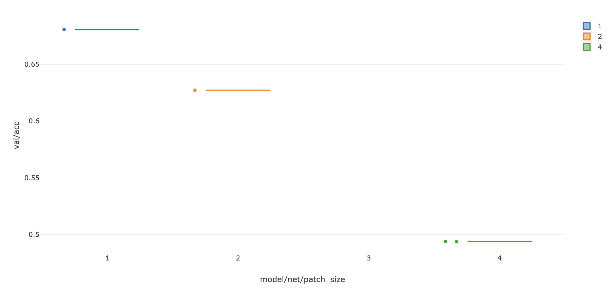

## Summary

In this assignment, we've harnessed a range of powerful tools, including MLflow, Aim, Tensorboard, and CSV Loggers, to meticulously track and analyze the performance of our machine learning model across a multitude of experiments.

While it's entirely feasible to conduct model development and performance tracking on a local machine, we've elevated our approach by encapsulating the entire process within a Docker container.

Here's a step-by-step breakdown of the process:

1. **Development**: To train our model with different patch sizes, we've updated the CIFAR10 model to accept patch sizes as parameters. These updates have been incorporated in the [CIFAR10 model component](https://github.com/shariqfarhan/EMLOV3/blob/assignment_6/copper/models/components/cifar10_dense_net.py).

2. **Configurations**: The model's parameters have been adjusted in the [model config file](https://github.com/shariqfarhan/EMLOV3/blob/assignment_6/configs/model/cifar10.yaml).

3. **Experiment Setup**: These details are subsequently referenced and included in the [experiment config file](https://github.com/shariqfarhan/EMLOV3/blob/assignment_6/configs/experiment/vit.yaml).

4. **Dockerization**: Once all the necessary changes have been made to the core components, we've crafted a [Dockerfile](https://github.com/shariqfarhan/EMLOV3/blob/assignment_6/Dockerfile) to orchestrate our experiments within a Docker container.

   **Docker Image Build Command**:
   ```bash
   docker build -t vit_train -f Dockerfile .
   ```

   **Docker Container Launch Command**:
   ```bash
   docker run -it -p 5000:5000 -v /workspace/EMLOV3:/workspace/  vit_train bash
   ```

   Within this container, we've mounted the local directory `/workspace/EMLOV3/` to a directory inside the container. Upon entering the container, we execute the following commands:

   - `pip install -e .`: This command installs the necessary Copper library inside the container.
   - `copper_train -m hydra/launcher=joblib hydra.launcher.n_jobs=3 experiment=vit model.net.patch_size=1,2,4 trainer.max_epochs=1 data.num_workers=0`: We execute this command to initiate training for three different patch sizes (1, 2, and 4) for a single epoch.

   The dockerfile can be accessed from dockerhub with this command 
   ```
   docker pull shariqfarhan/vit_train:latest
   ```

5. **MLflow for Experiment Tracking**: Simultaneously, we set up a dedicated Docker container for the MLflow user interface. We've utilized the `ubuntu/mlflow:2.1.1_1.0-22.04` image from Docker Hub to achieve this.

   **Docker Image Pull Command**:
   ```bash
   docker pull ubuntu/mlflow:2.1.1_1.0-22.04
   ```

   **Docker Container Launch Command**:
   ```bash
   docker run -it -v /workspace/EMLOV3/:/workspace/ -p 5001:5000 ubuntu/mlflow:2.1.1_1.0-22.04 bash
   ```

   Within the MLflow container, we navigate to the `logs/mlflow` folder and execute the following command:

   - `mlflow ui --host 0.0.0.0`: This command starts the MLflow user interface, and by specifying the host as `0.0.0.0`, we ensure that the logs can be accessed from any system.

6. **Docker Image Cleanup**: To regain valuable disk space and delete all Docker images, you can use the following command:

   ```bash
   docker system prune -f
   ```

   This command efficiently removes all images and reclaims the associated space, which is particularly useful when dealing with images that consume a substantial amount of storage.

## Model Performance
The model performance as tracked with the mlflow ui. As the patch size increases the validation accuracy decreases, need to check how this would play out for patch sizes 8 & 16



## Publishing Changes to a Remote Repository

If you're creating a replica of a GitHub repository and encounter authentication errors while attempting to publish your changes, follow these steps to track your work and continue building upon it:

1. Create a new branch:
   ```bash
   git checkout -b <branch-name>
   ```

2. Add all modified files to your local repository:
   ```bash
   git add .
   ```

3. Commit the changes with a descriptive message:
   ```bash
   git commit -m "Your commit message here"
   ```

4. Link your local repository to a remote repository by specifying a branch name and its corresponding repository:
   ```bash
   git remote add <branch-name> <repository-name>
   ```

   For example:
   ```bash
   git remote add assignment_6 https://github.com/shariqfarhan/EMLOV3
   ```

5. Push your local changes to the remote repository:
   ```bash
   git push
   ```

This process creates a new branch in the specified remote repository, enabling you to seamlessly manage and expand upon your work.

---


```
git push --set-upstream origin assignment_7
```
